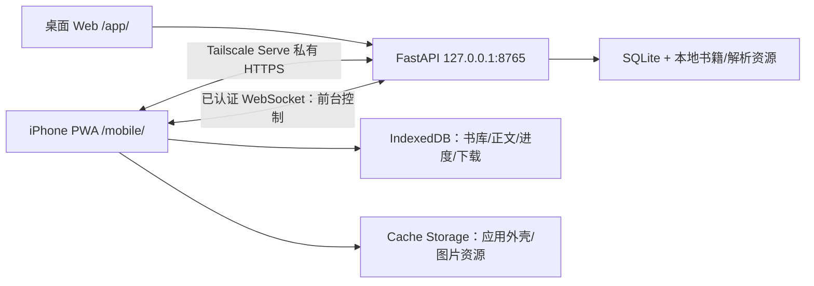

# Listen Book Mobile PWA 技术方案

> 方案版本：v0.1
>
> 状态：已批准，M0 开发与自动验证完成，iPhone 实机验收未完成
>
> 对应 PRD：`docs/mobile-pwa-prd.md`
> 目标仓库：`D:\CodexProject\listen-book`

## 1. 方案结论

在现有 `listen-book` 单仓库内新增独立 Mobile PWA 和移动同步后端模块，复用 FastAPI、SQLite 和服务端书籍解析结果。桌面后端继续只监听 `127.0.0.1:8765`，通过 Tailscale Serve 向 Tailnet 内的 iPhone 提供 HTTPS。

核心设计选择：

- 不在 iPhone 重新解析 EPUB；手机离线保存服务端生成的确定性解析包和资源。
- 保留现有桌面 `book_id`，新增文件内容 SHA-256 作为跨设备书籍身份，避免破坏现有桌面数据。
- 保留现有播放进度字段，新增稳定文字锚点字段；移动同步只读写文字锚点。
- 使用 Service Worker 缓存应用外壳，使用 IndexedDB 保存书籍、解析内容、进度、下载状态和设备凭证，使用 Cache Storage 保存图片等响应资源。
- 使用应用级一次性配对和随机设备凭证；Tailscale 不是唯一认证边界。
- 使用已认证 WebSocket 作为“手机正在前台”的控制通道；书籍和进度数据仍通过普通 HTTPS API 传输。
- 电脑发起同步时若没有活跃手机连接，立即拒绝，不创建离线队列。
- 先实现 M0 并由用户在真实 iPhone 上验收，再扩展完整 MVP。

## 2. 现有系统审计

### 2.1 当前技术栈

- Python、FastAPI、Uvicorn。
- SQLite 本地数据库。
- 原生 HTML、CSS、JavaScript 桌面前端。
- `ebooklib` 和 BeautifulSoup 解析 EPUB。
- 现有服务通过 `127.0.0.1:8765` 提供 `/app/` 和 `/api/`。
- 已有 TXT、Markdown、EPUB 解析、EPUB 资源落盘、固定阅读区分页、文字阅读位置和播放位置保存。

### 2.2 可复用能力

- `app/backend/book_parser.py` 已输出章节、段落、纯文本、受限 HTML、段落文本哈希和本地 EPUB 图片。
- `reading_progress` 已区分播放位置与文字阅读位置。
- 启动脚本、SQLite 初始化和现有单元测试可以继续使用。
- 现有前端已具备内容分页和基于段落/句子的恢复逻辑，可作为移动阅读器算法参考。

### 2.3 必须补齐的差距

- 当前 `book_id` 基于绝对路径、文件大小和修改时间的 SHA-1，不是内容 SHA-256。
- 当前文字位置缺少字符偏移、锚点文本哈希和独立的文字更新时间。
- 后端未提供移动认证、配对、断点下载、移动清单和同步控制协议。
- 当前静态前端没有 Manifest、Service Worker、IndexedDB 离线书库或移动布局。
- 当前同步 API 没有方向、预览、历史和原子覆盖语义。

## 3. 目标架构



### 3.1 建议目录

```text
listen-book/
├─ app/
│  ├─ backend/
│  │  ├─ main.py
│  │  ├─ db.py
│  │  ├─ book_parser.py
│  │  └─ mobile/
│  │     ├─ routes.py
│  │     ├─ auth.py
│  │     ├─ pairing.py
│  │     ├─ catalog.py
│  │     ├─ progress.py
│  │     ├─ sync.py
│  │     └─ models.py
│  ├─ frontend/                 # 现有桌面端，保持兼容
│  └─ mobile/                   # 新增 Mobile PWA，独立样式和状态
│     ├─ index.html
│     ├─ manifest.webmanifest
│     ├─ sw.js
│     ├─ styles.css
│     ├─ icons/
│     └─ src/
│        ├─ app.js
│        ├─ api.js
│        ├─ db.js
│        ├─ library.js
│        ├─ reader.js
│        ├─ pagination.js
│        ├─ progress.js
│        ├─ downloads.js
│        └─ sync.js
├─ docs/
├─ scripts/
│  └─ configure_mobile_access.ps1
└─ tests/
   ├─ mobile_backend/
   └─ mobile_frontend/
```

M0 延续现有“无前端打包器”架构，使用原生 ES Modules 和 JSDoc 类型声明，不引入运行时 CDN、遥测或额外业务网络请求。这样双击现有快捷方式即可运行，不要求用户额外执行 npm 构建。若完整 MVP 期间代码规模证明需要 TypeScript，再单独评审迁移，不在 M0 中预先引入。

## 4. 网络与运行模型

### 4.1 本地服务

- Uvicorn 仍绑定 `127.0.0.1:8765`。
- 桌面界面继续位于 `/app/`。
- Mobile PWA 位于 `/mobile/`，Service Worker scope 限定为 `/mobile/`。
- 移动 API 位于 `/api/mobile/`。
- 不启用 Tailscale Funnel，不监听 `0.0.0.0`，不开放路由器端口。

### 4.2 Tailscale Serve

禁止使用把整个 `8765` 端口暴露给 Tailnet 的 Serve 配置，因为现有 `/app/`、导入、删除、播放、TTS 和悬浮窗 API 没有移动认证。Serve 必须使用显式路由 allowlist，只映射 `/mobile/` 和 `/api/mobile/`；`/app/`、`/api/books*`、`/api/player*`、`/api/overlay*` 和桌面管理 API 均不得从 Tailnet 地址访问。

实现阶段新增 `scripts/configure_mobile_access.ps1`：

1. 检查 Tailscale 是否已登录且运行。
2. 检查 `127.0.0.1:8765` 健康状态。
3. 记录 Tailscale 版本和现有 Serve 结构化配置，避免覆盖无关规则。
4. 按本机版本能力生成只允许移动路由的配置，并做桌面路由负向探测。
5. 如果当前 Tailscale 版本不能安全表达路由 allowlist，则阻止 M0，不得降级为整端口暴露；后备方案是另行评审独立移动网关端口。
6. 输出检测到的私有 HTTPS 地址和精确撤销本产品映射的命令。

Serve 配置只执行一次并可持久化。脚本只删除本产品创建的映射，不使用会清空用户其他规则的全量 reset。Tailscale 不可用时，桌面现有功能继续正常工作。

桌面发起配对、确认、撤销和创建同步任务使用 `/api/desktop/mobile/*`，这些路由不进入 Serve allowlist。桌面页面先从直接回环 origin 获取短时管理会话，服务端设置 `HttpOnly`、`SameSite=Strict` 会话 Cookie 并返回独立 CSRF token；管理写请求必须同时验证会话、CSRF、直接本地 Origin/Host 且不存在代理转发标记。安全判断不得只依赖 `request.client.host`。经 Tailnet 地址访问桌面页面、桌面 API 或管理 API必须返回 404/403，并纳入自动测试。

### 4.3 前台在线判定

- Mobile PWA 打开后连接 `/api/mobile/control` WebSocket。
- 建连后的第一条消息提交设备 ID 和凭证，凭证不放在 URL。
- 手机每 5 秒发送 heartbeat；页面进入后台时主动发送 `suspended` 并断开连接。
- 服务端仅把“已认证连接存在且最近 heartbeat 不超过 15 秒”视为最近活跃的前台会话，不宣称能证明 iOS 此刻一定可执行。
- 电脑发起同步但条件不满足时返回 `409 mobile_not_foreground`，不创建任务。
- 每次连接生成 `connection_epoch`；创建任务、刷新快照和每本提交前都验证同一 epoch 仍活跃。同步途中连接失效超过 15 秒，任务进入终态：进行中的进度事务回滚，已完整提交的内容保留，未完整下载保留为中断状态，未开始项标记失败；再次打开手机不会自动恢复旧同步任务。

WebSocket 只承载控制消息、进度和状态，不传输书籍正文或二进制资源。

## 5. 书籍身份与解析包

### 5.1 双重身份

保留：

```text
books.id              # 现有桌面主键，不改变旧路由和关联
```

新增：

```text
books.content_hash    # 原始文件字节 SHA-256，移动端跨设备身份
books.parser_version  # 解析规则版本，例如 mobile-parser-v1
```

规则：

- 新导入书籍同步计算 `content_hash`。
- 旧书在首次打开移动功能或生成移动清单时后台补算，不阻塞桌面应用启动。
- 文件不可读时在移动清单中标记不可下载，不影响桌面已有解析内容和阅读。
- 内容哈希变化视为新书，不更新旧哈希对应的手机副本。
- 移动 API 使用 `content_hash`，内部再映射到桌面 `book_id`。
- API 永不返回桌面绝对文件路径。

跨设备兼容键固定为 `(content_hash, parser_version, anchor_version)`。MVP 冻结 `mobile-parser-v1`；内容哈希相同但解析或锚点版本不同的旧包继续可离线阅读，状态显示“需更新解析包”，完成包更新前返回 `parser_version_mismatch` 并禁止进度覆盖。全量同步不能只凭内容哈希相同跳过解析包更新。

同一 `content_hash` 对应多个桌面条目时，canonical 规则为：优先选择原文件可读的记录，其次按 `created_at` 最早，最后按 `book_id` 字典序最小。移动清单、元数据和文字进度只取 canonical 记录，重复条目不参与移动同步并显示诊断提示。原文件内容改变时创建新的移动内容身份，新身份的移动文字进度为空，不把旧哈希进度自动关联到新哈希。

### 5.2 服务端解析包

手机不直接运行 EPUB 解析器。服务端为每本书提供确定性资源清单：

```json
{
  "schema_version": 1,
  "parser_version": "mobile-parser-v1",
  "anchor_version": 1,
  "package_revision": "immutable-revision",
  "book_content_hash": "sha256-hex",
  "metadata": {},
  "chapters": [],
  "resources": [
    {
      "resource_id": "stable-id",
      "type": "chapter|image|cover|original",
      "byte_size": 0,
      "sha256": "sha256-hex",
      "etag": "strong-etag",
      "required": true,
      "url": "/api/mobile/books/..."
    }
  ]
}
```

章节与段落编号完全沿用指定 `parser_version` 的服务端解析结果，确保兼容版本使用同一内容坐标系。正文、正文引用图片和离线阅读所需样式为必需资源；封面为非必需资源。M0 只要求阅读必需解析包和图片，原始 EPUB 在完整 MVP 中作为必需资源保存。HTML 继续使用现有白名单净化；所有远程 URL、脚本、iframe、事件属性和 `@import` 均被移除。

清单生成时固定 `content_hash + package_revision + strong ETag`。后续资源请求必须绑定该版本；源文件或解析包变化时返回 `409 package_changed`，客户端丢弃对应资源的旧分块并重新获取清单，不得在同一 ETag 下返回不同字节。

## 6. 内容锚点规范

### 6.1 锚点结构

```json
{
  "book_content_hash": "sha256-hex",
  "parser_version": "mobile-parser-v1",
  "chapter_index": 3,
  "paragraph_index": 12,
  "character_offset": 48,
  "anchor_text_hash": "sha256-hex",
  "anchor_asset_id": null,
  "anchor_version": 1,
  "client_updated_at": "RFC3339 UTC"
}
```

- 捕获点是当前视觉页第一个可见、可读正文字符；`character_offset` 表示该字符在服务端规范化段落纯文本中的 Unicode code point 偏移。
- 规范化先把 CRLF/CR 转为 LF，再做 Unicode NFC；不折叠普通空格。
- 对长度为 `L` 的段落和偏移 `O`，窗口起点 `S = min(max(O - 32, 0), max(L - 64, 0))`，终点 `E = min(S + 64, L)`，窗口为 `[S, E)`。
- `anchor_text_hash = SHA-256(UTF-8(normalized_text[S:E]))`，UTF-8 不带 BOM。恢复扫描逐个 code point 生成同一算法的候选窗口；多个候选相同时选择与原偏移距离最近者，再选择较小偏移。
- 图片或空文本页使用 `anchor_asset_id` 记录稳定资源 ID，并同时保存最近的前一个可读文字锚点；目标设备优先定位资源，找不到资源时退回文字锚点。
- `local_visual_page` 只保存在设备本地，不进入覆盖主键。
- 界面预览附近文字时临时从正文生成，不把正文写入安全日志或同步历史摘要。

### 6.2 恢复顺序

1. 校验书籍内容哈希。
2. 仅在 `parser_version` 和 `anchor_version` 兼容时，在指定章节、段落和字符偏移验证锚点哈希。
3. 验证失败时，在同一段落扫描匹配窗口。
4. 仍失败时，在前后各 3 个段落扫描。
5. 再失败时降级到指定段落开头，并向用户显示“已恢复到附近位置”。
6. 章节或段落越界时恢复到全书首个可读段落，不抛出空白页。

手机和服务端各有同一组固定测试向量，覆盖中文、CRLF、NFC/NFD、重复句、空段、emoji、ZWJ 和图片页，防止 JavaScript UTF-16 与 Python Unicode 索引差异。

### 6.3 现有进度迁移

`reading_progress` 新增：

```text
reading_character_offset INTEGER
reading_anchor_text_hash TEXT
reading_anchor_asset_id TEXT
reading_parser_version TEXT
reading_anchor_version INTEGER NOT NULL DEFAULT 1
reading_updated_at TEXT
```

迁移时根据现有 `reading_chapter_index`、`reading_paragraph_index` 和 `reading_sentence_index` 计算字符位置；无法精确计算时使用段落开头。现有以下字段原样保留：

```text
chapter_index
paragraph_index
audio_position_ms
has_playback_position
voice
rate
volume
```

移动同步只更新 `reading_*` 字段和 `reading_updated_at`，绝不更新播放字段。

API 与桌面数据库映射固定如下：

| API 锚点字段 | `reading_progress` 字段 |
|---|---|
| `chapter_index` | `reading_chapter_index` |
| `paragraph_index` | `reading_paragraph_index` |
| `character_offset` | `reading_character_offset` |
| `anchor_text_hash` | `reading_anchor_text_hash` |
| `anchor_asset_id` | `reading_anchor_asset_id` |
| `parser_version` | `reading_parser_version` |
| `anchor_version` | `reading_anchor_version` |
| `client_updated_at` | `reading_updated_at`（仅展示，不参与方向判断） |

`reading_revision` 是每个目标端文字进度的单调递增版本。桌面日常阅读保存、手机本地保存、同步覆盖、撤销和 JSON 恢复只要实际持久化锚点发生变化，都必须在同一事务中将 revision 加 1；保存相同锚点不递增。任何文字进度写入口不得绕过该规则。预览返回当前 revision，后续条件写入不匹配时必须重新预览。

## 7. 手机本地存储

### 7.1 IndexedDB

数据库名：`listen-book-mobile`，初始版本 1。

对象仓库：

```text
settings          主题、字号、行距、数据库版本
device            device_id、设备凭证、配对状态
books             离线书籍元数据和完成状态
chapters          [content_hash, chapter_index]
paragraphs        [content_hash, chapter_index, paragraph_index]
progress          content_hash
progress_history  content_hash（仅一条）
downloads         content_hash、阶段、字节数、错误、资源列表
download_chunks   [content_hash, resource_id, chunk_index]
book_files        [content_hash, chunk_index]（完整 MVP 原始文件分块）
sync_log          最近有限数量的操作结果，不含正文或凭证
```

### 7.2 Cache Storage

- `listen-book-shell-vN`：HTML、CSS、JS、Manifest 和图标。
- `listen-book-assets-v1`：已校验的封面和 EPUB 图片响应。
- Service Worker 更新只替换旧应用外壳缓存，不删除 IndexedDB 或书籍资源。
- 独立维护 app shell、IndexedDB schema 和解析包三种版本。新 shell 激活前检查兼容性；不兼容时完成迁移或提示刷新，不自动清库，也不在同一运行期强制 `skipWaiting` 混用新旧代码。至少保留上一个可启动 shell，直到新版本成功启动。

### 7.3 下载与原子完成

1. 获取固定 `package_revision` 的资源清单、必需标记、总大小和预计峰值占用。
2. 使用 `navigator.storage.estimate()` 作预警；可用估算低于服务端预计峰值加 20 MiB 时阻止开始，但该估算不视为可写保证。每次写入仍捕获 `QuotaExceededError` 并给出清理/重试操作。
3. 资源先写 staging key/cache。大文件使用 HTTP Range 和固定大小分块，严格校验强 ETag、`206`、`Content-Range`、总长和最后一块；版本变化或 `200/412/416` 不符合续传条件时丢弃该资源旧块。
4. 在 Worker 中使用内置、无网络依赖的增量 SHA-256 校验，禁止为校验一次性拼接大 Blob。
5. 所有 `required=true` 的资源验证成功后，在 IndexedDB 事务中提交不可变 manifest 指针和`offline`状态。Cache Storage 与 IndexedDB 不能组成跨存储事务，因此每次打开书籍都按 manifest 检查必需缓存；缺失时立即降级为`incomplete`。
6. 失败或取消时保留可续传 staging 或按用户操作清理；未提交 manifest 永远不显示为离线完成。

M0 只实现阅读必需解析包和图片的完整下载、校验与失败后从头重试，不承诺断点续传，也不保存原始 EPUB。完整 MVP 再加入原始文件分块保存、暂停、继续、取消和通用断点续传。

## 8. 配对与认证

### 8.1 配对流程

1. 电脑页面通过已认证桌面管理会话调用 `POST /api/desktop/mobile/pair/start`。
2. 服务端生成约 50-bit、10 位 Crockford Base32 一次性短码，仅存摘要，默认 5 分钟失效；按来源和会话严格限速。
3. 电脑二维码只包含不带秘密的 `/mobile/` 安装地址。用户在 Safari 添加到主屏幕后，从主屏独立打开 PWA；设计上按 Safari 与 standalone 存储完全隔离处理。
4. 用户在主屏 PWA 输入短码。首次合法 `pair/request` 原子消费短码，并返回 256-bit `pairing_poll_secret`；该 secret 只保存在 PWA 内存中。
5. 电脑显示待确认设备；用户通过桌面管理会话确认。
6. 服务端根据本地 server secret、会话随机盐和设备 ID 确定性生成 256-bit 永久设备凭证，数据库保存其摘要。PWA 使用 `session_id + pairing_poll_secret` 在短 TTL 内幂等领取同一凭证，写入 IndexedDB 成功后发送 ACK；ACK 后服务端删除可再生成凭证所需的会话盐。
7. 重复、过期、拒绝、已 ACK 或 secret 错误的请求不得返回凭证。所有配对响应使用 `Cache-Control: no-store`，Service Worker 不缓存移动 API。
8. 之后 REST 使用 `Authorization: Bearer`，WebSocket 在首条消息认证，永久凭证不进入 URL、日志或导出文件。

### 8.2 认证规则

- MVP 只允许一个未撤销移动设备。
- 新设备配对前要求用户明确撤销旧设备，不能静默替换。
- 连续认证失败按来源和设备 ID 做短时指数退避。
- 比较凭证摘要使用恒定时间比较。
- 配对、确认、撤销写安全日志；凭证、正文和附近文字不写日志。
- 移动页面设置严格 CSP，不使用第三方脚本，降低 IndexedDB 凭证被窃取风险。
- 移动 REST、WebSocket 和配对响应均禁止缓存；校验允许的 HTTPS Origin 和 WebSocket Origin。认证失败退避设上限并在成功认证或冷却期结束后恢复，不能永久锁死合法设备。
- 设备撤销只禁止后续在线 API，不删除手机离线书籍或本地进度；重新配对保留本地数据。
- 安全日志只记录时间、事件类型、结果码、任务 ID 和脱敏设备 ID，不记录请求体、配对短码、polling secret、永久凭证、正文、附近文字或绝对路径。桌面保留最近 30 天且最多 2,000 条，手机保留最近 200 条，超限滚动删除。

## 9. 同步协议

### 9.1 原则

- 每次请求必须明确包含 `direction`。
- 同步前预览、方向选择和确认分离。
- 每本书是独立原子事务，批次不是跨书大事务。
- 不比较更新时间决定方向；更新时间只用于预览。
- 目标端旧文字进度在成功写入前保留。
- 手机独有书籍不上传、不删除。
- 来源端没有有效文字进度时返回 `source_progress_missing` 并跳过，不把空值解释为回到开头；来源锚点非法时返回 `invalid_source_anchor`，目标端和历史不变。
- 每次确认生成唯一 `operation_id`，覆盖与撤销都持久化去重。写入携带预览时的 `target_revision` 和当前 `connection_epoch`；任一不匹配都返回冲突并要求重新预览，防止响应丢失重试、并发写入或手机切后台破坏历史。

### 9.2 前台控制消息

手机连接后发送当前本地清单摘要：

```json
{
  "type": "device_snapshot",
  "books": [
    {
      "content_hash": "...",
      "offline": true,
      "progress": {},
      "dirty": true
    }
  ]
}
```

电脑创建同步前要求快照时间不超过 15 秒；否则通过 WebSocket 请求刷新。同步任务消息只包含任务 ID、方向和书籍哈希，具体数据通过认证 REST API 获取或提交。

### 9.3 单本覆盖

`电脑 → 手机`：

1. 获取两端预览。
2. 用户确认。
3. 手机在一个覆盖 `progress`、`progress_history`、同步元数据和 operation 去重记录的 IndexedDB `readwrite` 事务中，同时保存本机旧进度、写入电脑锚点并更新 revision；任一步失败整体 abort。
4. 提交后回报相同 `operation_id` 的结果；重复提交返回首次结果，不再次替换历史。

`手机 → 电脑`：

1. 获取两端预览。
2. 用户确认。
3. 服务端使用 `BEGIN IMMEDIATE`，在同一 SQLite 事务中验证 revision、保存桌面旧文字进度历史、执行专用列级 `UPDATE reading_*`、更新 revision 和 operation 去重记录；任一步失败整体回滚。
4. 禁止复用现有会 `INSERT OR REPLACE` 整行的桌面进度保存函数；播放位置和语音设置不参与 UPDATE。

### 9.4 全量同步

- `电脑 → 手机`的书籍集合是电脑主书库全部可下载书籍；只有兼容键相同且必需资源完整的手机副本才跳过内容下载，仍按选择方向覆盖文字进度。
- `手机 → 电脑`的集合是桌面与手机内容哈希交集。
- 每本分别记录 `content_result = downloaded | already_complete | unavailable | failed` 和 `progress_result = overwritten | unchanged | source_missing | incompatible | failed`，总体状态为 `success | partial | skipped | failed`。内容已完整提交但进度失败时保留书籍并显示“书籍已下载，进度未覆盖”。
- 单本失败继续下一本。
- 手机断开时进行中的进度事务回滚，已提交内容保留，未完整下载保持 interrupted，未开始项标记 `failed: mobile_disconnected`，不会等待下次打开。
- 失败项可在手机仍前台时重试；重试创建新任务。

### 9.5 撤销

- 桌面作为目标时，SQLite 每本书只保留最近一条覆盖前文字进度。
- 手机作为目标时，IndexedDB 每本书只保留最近一条。
- 撤销使用同样的 `operation_id`、revision 检查和原子事务；失败时当前进度与历史均保持不变。
- 撤销成功后历史标记已消费，不能再次使用且不形成 redo。新一次成功覆盖替换尚未消费的旧历史；不支持跨多次历史或整批回滚。

## 10. API 草案

### 10.1 配对与设备

```text
POST   /api/desktop/mobile/session               # 直接本地 origin 建立管理会话
POST   /api/desktop/mobile/pair/start             # 管理会话 + CSRF
POST   /api/desktop/mobile/pair/{session_id}/confirm
DELETE /api/desktop/mobile/device/{device_id}
POST   /api/mobile/pair/request                   # 短码换 polling secret
POST   /api/mobile/pair/{session_id}/claim        # polling secret 幂等领取
POST   /api/mobile/pair/{session_id}/ack
GET    /api/mobile/device
WS     /api/mobile/control
```

### 10.2 书籍与下载

```text
GET /api/mobile/sync/manifest
GET /api/mobile/books/{content_hash}/metadata
GET /api/mobile/books/{content_hash}/package
GET /api/mobile/books/{content_hash}/chapters/{chapter_index}
GET /api/mobile/books/{content_hash}/assets/{resource_id}
GET /api/mobile/books/{content_hash}/download     # 支持 Range、ETag、If-Range
```

### 10.3 进度与同步

```text
GET  /api/mobile/books/{content_hash}/progress/preview
POST /api/mobile/books/{content_hash}/progress/overwrite
POST /api/mobile/books/{content_hash}/progress/undo
POST /api/mobile/sync/preview
POST /api/mobile/sync/jobs
GET  /api/mobile/sync/jobs/{job_id}
POST /api/mobile/sync/jobs/{job_id}/items/{content_hash}/result
POST /api/mobile/sync/jobs/{job_id}/retry
```

写入请求使用 Pydantic 明确模型、枚举和边界校验，禁止接收客户端文件路径。覆盖、撤销和结果提交必须包含 `operation_id`、`target_revision`、`connection_epoch` 和明确 `direction`。错误响应统一包含：

```json
{
  "error": {
    "code": "mobile_not_foreground",
    "message": "请先在手机上打开应用",
    "retryable": true
  }
}
```

## 11. 数据库变更

### 11.1 兼容性策略

- 不重命名或删除现有表和字段。
- 新字段允许旧代码继续工作。
- 新表使用 `CREATE TABLE IF NOT EXISTS`。
- 引入轻量 `schema_migrations` 表记录移动功能迁移版本，但不重写已有迁移机制。
- 旧 `_ensure_column` 只负责历史兼容；移动迁移仅在应用启动时取得单实例锁并用 `BEGIN IMMEDIATE` 事务执行，不在每次 `get_db()` 中运行。
- 每个迁移必须可重复启动、检测半完成状态，并在旧库副本、重复启动和失败恢复场景验证。

### 11.2 新增或扩展

```text
books
  + content_hash TEXT NULL
  + parser_version TEXT NULL

reading_progress
  + reading_character_offset INTEGER NULL
  + reading_anchor_text_hash TEXT NULL
  + reading_anchor_asset_id TEXT NULL
  + reading_parser_version TEXT NULL
  + reading_anchor_version INTEGER NOT NULL DEFAULT 1
  + reading_updated_at TEXT NULL
  + reading_revision INTEGER NOT NULL DEFAULT 0

mobile_devices
mobile_pairing_sessions
mobile_sync_jobs
mobile_sync_job_items
mobile_operations
progress_history
schema_migrations
```

书籍内容哈希先使用普通索引，不直接给旧数据增加唯一约束。重复内容使用 §5.1 的固定 canonical 规则；桌面书库不自动合并或删除重复条目。哈希后台补算期间，清单明确返回 `hash_pending`，不静默漏书。

## 12. Mobile PWA 界面

### 12.1 信息架构

```text
单页书库
├─ 连接状态与刷新
└─ 书名列表（默认全部收起）
   └─ 单开手风琴详情
      ├─ 作者、格式与离线状态
      └─ 下载 / 继续阅读

全屏阅读器
├─ 顶部返回、精简书名、章节/本地页码与 Aa 设置
├─ 固定正文区（流式适配手机列宽）
└─ 左右滑动或左右半屏短按翻页
```

阅读器采用全屏固定正文区和可收起设置面板，不显示底部翻页按钮。左滑或点击正文右半屏进入下一页，右滑或点击正文左半屏返回上一页；长按选字、拖动选区、链接和图片交互优先，不触发翻页。视觉设计面向单手操作重新设计，不复刻桌面悬浮窗或音频控制。

书库的 iPhone 最近阅读时间只在成功翻过至少一页后更新，并用于已读书倒序排列；未读书随后按书名排序。手机展示标题由原始 EPUB 元数据派生为“主书名＋版本”，作者读取 `DC creator`；原始完整标题继续保存在桌面数据库。

### 12.2 状态表达

- 网络状态、电脑可达状态、设备配对状态分开显示。
- “已连接 Tailscale”不等同于“电脑服务可达”。
- 每本书分别保存 `offline_status`、`progress_status` 和 `sync_status`；三者可同时存在。只有对应方向进度覆盖成功才把本机 `locally_modified` 清为 `clean`，内容下载成功不清除 dirty 状态。
- 下载和同步状态使用文字、图标和颜色共同表达。
- 所有覆盖操作使用明确箭头、来源/目标名称、附近文字和二次确认。

## 13. 实施阶段

### 13.1 M0：高风险链路验证

M0 内部分两步开发，但只在 M0b 完成后进行一次用户实机验收：

**M0a：离线与网络边界**

1. 新增兼容性数据库字段和内容 SHA-256。
2. 新增独立 `/mobile/` PWA 外壳、Manifest、Service Worker 和 IndexedDB 基础层。
3. 配置只暴露移动路由的 Tailscale Serve，并验证 Tailnet 地址不能访问任何桌面页面和旧 API。
4. 实现一本 EPUB 的服务端解析包、必需图片完整下载和校验；M0 不保存原始 EPUB、不承诺断点续传。
5. 验证 Safari 与主屏 standalone 存储隔离，完成固定阅读区分页、离线启动和本地锚点恢复。

**M0b：配对与进度覆盖**

6. 在主屏 PWA 内实现短码配对、凭证领取与单设备认证。
7. 实现已认证的最近活跃前台会话、单本双向文字进度覆盖、幂等和并发保护。
8. 完成桌面浏览器离线检查（开发辅助测试，不是产品交付项）。
9. 暂停开发，由用户执行 iPhone 10 分钟飞行模式验收。

### 13.2 M1：离线书库 MVP

- TXT、Markdown 和 EPUB 通用下载。
- 下载列表、暂停、继续、取消、失败恢复和空间检查。
- 手机书库、电脑书库、删除副本和未同步进度保护。

### 13.3 M2：全量同步

- 电脑端一键同步入口。
- 前台检测、全量预览、方向选择和确认。
- 逐本任务结果、失败重试和最近一次撤销。

### 13.4 M3：日常使用版本

- 进度 JSON 导入导出。
- 设备重新配对体验、数据迁移、异常恢复和完整回归。
- 使用说明、Serve 配置脚本和发布检查。

## 14. 测试方案

### 14.1 自动测试

后端单元与集成测试：

- 文件内容 SHA-256 与重复书映射。
- 旧数据库向前迁移及重复执行。
- 配对过期、一次性消费、确认、撤销和认证失败限流。
- polling secret 领取、响应重试、ACK 和主屏 PWA 内凭证持久化。
- API 不返回绝对路径；除经 polling secret 授权的配对领取响应外，任何 API 不返回永久凭证。
- 强 ETag、Range/Content-Range、包变化、断点和校验失败。
- 文字进度覆盖不修改播放字段。
- 覆盖失败回滚、operation 幂等、revision 冲突、最近历史消费和撤销。
- 全量同步单本失败继续执行。
- 手机不在前台时不创建同步任务。
- Tailnet 地址访问 `/app/`、书籍导入/删除、播放、TTS、悬浮窗和桌面管理 API 全部被拒绝。

前端纯函数测试：

- Python 与 JavaScript 内容锚点固定测试向量一致，覆盖解析版本不兼容、重复窗口、emoji/ZWJ 和图片页。
- 分页后按锚点恢复。
- 下载状态机和离线完成原子标记。
- JSON 备份校验和哈希不匹配处理。

浏览器检查：

- Service Worker 首次缓存、更新和离线启动。
- IndexedDB 升级不丢数据。
- Safari 页面与主屏 standalone 不共享状态时，配对仍在 standalone 内完成。
- 桌面与移动路由、CSS 和状态互不影响。
- 网络中断、后台切换和重连。
- iPhone 视口下 EPUB 固定宽度和禁止换行样式被覆盖，正文不裁切，分页栏宽与翻页步长一致。
- 单页章节可通过滑动或半屏短按跨章；长按、拖动、链接和图片不误触翻页。
- 书库默认收起、单开手风琴、下载后留在列表，以及 iPhone 最近阅读排序。

### 14.2 最快回归命令

```powershell
.\.venv\Scripts\python.exe -m compileall app tests
.\.venv\Scripts\python.exe -m unittest discover -s tests
node --check app\frontend\app.js
```

实现移动模块后追加移动 JavaScript 语法检查和纯函数测试。每次先运行受影响模块测试，再运行完整回归。

### 14.3 M0 iPhone 实机验收

1. Safari 打开私有 HTTPS 地址并扫码配对。
2. 添加到主屏幕并独立启动。
3. 下载一部含图片 EPUB，核对 SHA-256 和离线状态。
4. 开启飞行模式阅读 10 分钟，翻页、切后台、退出并重开。
5. 验证正文、图片、分页和本地进度。
6. 恢复网络，分别执行一次双向文字进度覆盖。
7. 验证两端附近文字一致，电脑播放位置和语音设置不变。
8. 从 Tailnet 地址尝试访问桌面页面和旧 API，确认均不可达。

## 15. 回滚与数据保护

- 实现前备份 `app/data/app.sqlite`，备份只保存在本机且不提交 Git。
- 数据库变更只新增；关闭移动路由即可回退应用代码，旧桌面端仍可读取原字段。
- Mobile PWA 使用独立 `/mobile/`、独立 IndexedDB 名称和独立缓存名称。
- 配置 Serve 前保存版本和结构化配置快照；回滚只移除本产品创建的移动路由并做前后 diff，不使用可能影响其他规则的全量 reset。
- M0 不修改或删除现有书籍、EPUB 资源、音频缓存和播放进度。
- 手机端删除操作只影响手机 IndexedDB/Cache Storage。
- 不使用 `git reset --hard`、覆盖真实数据库或清理用户书库作为回滚手段。

## 16. 风险与缓解

| 风险 | 影响 | 缓解 |
|---|---|---|
| iOS 回收 PWA 存储 | 手机书籍和未同步进度丢失 | 持久存储请求、风险提示、JSON 导出、电脑主副本 |
| 手机后台暂停 WebSocket | 电脑误认为可同步 | heartbeat 15 秒有效期、后台主动断开、不排队 |
| 大 EPUB 校验占用内存 | 下载失败或页面被系统终止 | 分块存储、增量 SHA-256、资源逐项提交 |
| 解析版本变化 | 锚点偏移或重复下载 | `parser_version`、固定测试向量、旧包继续可读 |
| 旧书文件路径失效 | 无法重新下载 | 清单标记不可下载，不破坏桌面已有记录 |
| 进度方向误选 | 较旧位置覆盖较新位置 | 位置预览、明确箭头、确认、最近一次撤销 |
| 移动改动影响桌面 | 现有听书功能回归 | 独立模块、增量表字段、现有测试全量回归 |
| Tailscale 或 Serve 不可用 | 在线同步不可用 | 桌面继续本地工作、明确诊断、离线阅读不受影响 |

## 17. 评审门槛

进入实现前需要用户明确批准本技术方案。批准后仍按小步提交实施：

1. 先完成 M0 代码与自动测试。
2. 用户完成真实 iPhone 验收。
3. 只有 M0 通过后才进入 M1–M3。

本方案批准不等于授权删除 `listen-book-ios`、提交或推送 Git、清空数据、开放公网端口或启用 Tailscale Funnel；这些操作如有需要必须另行明确授权。
